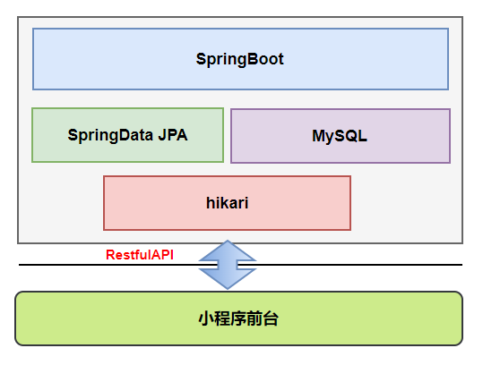
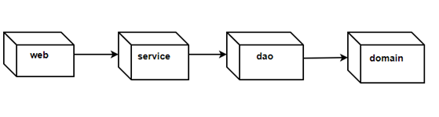
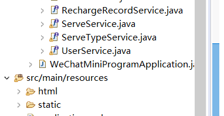
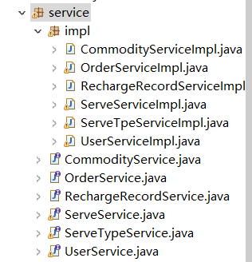
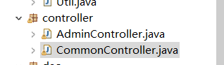

# 微信小程序后台

### 一.所用技术栈

ssh + spring boot + jpa + mysql + hikari



### 二.数据库设计

商品表(commodity)的结构如下：

| **字段** | **类型**        | **备注** |
| -------- | --------------- | -------- |
| id       | BIGINT NOT NULL | 主键     |
| content  | VARCHAR(255)    | 简介     |
| img      | VARCHAR(255)    | 图片     |
| name     | VARCHAR(255)    | 名称     |
| price    | VARCHAR(255)    | 价格     |
| imgs     | VARCHAR(255)    | 轮播图片 |

 

订单表(orders)的结构如下：

| **字段**    | **类型**        | **备注** |
| ----------- | --------------- | -------- |
| id          | BIGINT NOT NULL | 主键     |
| userId      | BIGINT          | 用户ID   |
| commodityId | VARCHAR(255)    | 商品id   |
| ordernumber | VARCHAR(255)    | 单号     |
| flag        | VARCHAR(255)    | 付款标记 |
| price       | VARCHAR(255)    | 总价格   |
| number      | INT(11)         | 数量     |
| create_data | DATETIME        | 创建时间 |

 

充值记录表(recharge_record)的结构如下：

| **字段**    | **类型**        | **备注** |
| ----------- | --------------- | -------- |
| id          | BIGINT NOT NULL | 主键     |
| userId      | BIGINT          | 用户ID   |
| ordernumber | VARCHAR(255)    | 单号     |
| price       | VARCHAR(255)    | 充值价格 |
| create_data | DATETIME        | 充值时间 |

 

 

预约服务表(serve)的结构如下：

| **字段**    | **类型**        | **备注**   |
| ----------- | --------------- | ---------- |
| id          | BIGINT NOT NULL | 主键       |
| serveTypeId | VARCHAR(255)    | 服务项目ID |
| dTime       | VARCHAR(255)    | 天         |
| hTime       | VARCHAR(255)    | 时分秒     |
| message     | DATETIME        | 备注       |

 

预约服务类型表(serve_type)的结构如下：

| **字段** | **类型**        | **备注** |
| -------- | --------------- | -------- |
| id       | BIGINT NOT NULL | 主键     |
| name     | VARCHAR(255)    | 名称     |

 

用户表(user)的结构如下：

| **字段**               | **类型**        | **备注**       |
| ---------------------- | --------------- | -------------- |
| id                     | BIGINT NOT NULL | 主键           |
| username               | VARCHAR(255)    | 用户名         |
| pasword                | VARCHAR(255)    | 密码           |
| name                   | VARCHAR(255)    | 姓名           |
| price                  | VARCHAR(255)    | 价格           |
| cardnumber             | VARCHAR(255)    | 会员卡号       |
| phone                  | VARCHAR(255)    | 电话           |
| shippingaddresshome    | VARCHAR(255)    | 收货地址(家)   |
| shippingaddresscompany | VARCHAR(255)    | 收货地址(公司) |
| balance                | VARCHAR(255)    | 余额           |

 

### 三.后端架构

后端实现使用service  dao  controller的三层分层设计，业务流程示意图如下：

（1）controller目录对应控制层，接收所有的请求。

（2）dao目录对应持久层。

（3）domain目录对应数据实体。

（4）service目录实现业务逻辑层。调用dao层持久化用户数据到数据库。




### 四.小程序后台思路

1.启动 springboot  执行WeChatMiniProgramApplication.java中的main方法



2.添加对service中的api增加来写controller层中的逻辑代码



3.添加controller层中逻辑代码



### 五. 部分代码说明


```java
   /**
     * @return wechat 查询账户支出记录
     * 
     */
    @PostMapping("/payout")
    public JsonResult payout() {
    	List<Orders> lists = orderService.getAllOrders();
    	List<Orders> needData = new ArrayList<Orders>();
    	for(Orders orders : lists) {
    		if(Long.parseLong(orders.getFlag()) == 1L) {
    			needData.add(orders);
    		}
    	}
    	return JsonResult.renderSuccess(needData);
    }
```

wechat后台账户支出情况不再是看 充值记录表(recharge_record) 中的情况 因为表中并没有记录支出信息 。


```java
/**
     * 登陆
     * @param username
     * @param password
     * @return
     */
    @ApiOperation(httpMethod = "POST", value = "登陆", notes = "登陆")
    @ApiImplicitParams({
            @ApiImplicitParam(name = "username", value = "用户名"),
            @ApiImplicitParam(name = "password", value = "密码")
    })
	@ResponseBody
    @PostMapping("/login")
    public JsonResult login(String username, String password, HttpSession session){
        MD5 md5 = new MD5();
        password = md5.getMD5ofStr(password);
        User user = userService.getUserByUserNameAndPasssword(username, password);
        if(user != null){
        	if(user.getFlag().equals(1)) {
        		//将user信息存入session
        		session.setAttribute("user", user);
        		return JsonResult.renderSuccess("",user);
        	}else {
        		return JsonResult.renderFail("权限不足");
        	}
        }
        return  JsonResult.renderFail("用户名或者密码错误");
    }
	
	/**
	 * 后台用户退出
	 * 
	 */
	@RequestMapping("/loginout")
	public ModelAndView loginout(HttpSession session) {
		session.invalidate();
		return new ModelAndView("login");
	}
```

其中用户登录把用户信息存入session中，退出通过session的invalidate()方法进行销毁（答案并不能确定是否是这样做，现实项目中一般就是这么处理）


### 六.其他注意事项

###### application.yml

 本人使用的是高版本的mysql 驱动有变化 自行修改配置


###### maven

maven 最好手动配置下setting.xml文件 修改下下载镜像 如果使用本来镜像可能会下载很慢

